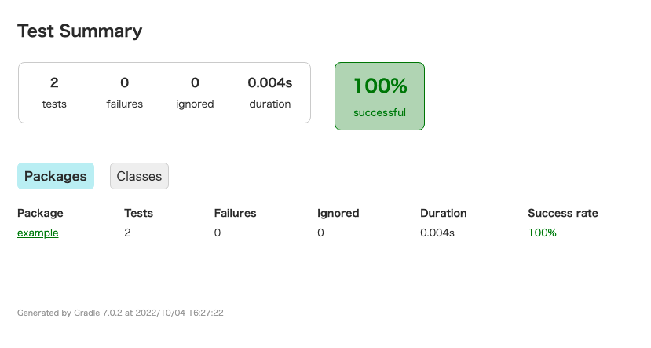

# Gradle test

## Recording test results

```sh
# Record build
$ BUILD_NAME=test
$ launchable record build --name ${BUILD_NAME} --source ..
Launchable recorded 1 commit from repository ~/launchable/samples/examples
Launchable recorded build test to workspace launchableinc/mothership with commits from 1 repository:

| Name   | Path   | HEAD Commit                              |
|--------|--------|------------------------------------------|
| ..     | ..     | dda6bed2bbcbff79c89abbb78296083ce6eaa6b5 |


# Run test
$ gradle test

Deprecated Gradle features were used in this build, making it incompatible with Gradle 8.0.
Use '--warning-mode all' to show the individual deprecation warnings.
See https://docs.gradle.org/7.0.2/userguide/command_line_interface.html#sec:command_line_warnings

BUILD SUCCESSFUL in 1s
3 actionable tasks: 1 executed, 2 up-to-date


# Record test result
$ launchable record tests --build ${BUILD_NAME} gradle ./build/test-results/test
Launchable recorded tests for build test (test session 15) to workspace launchableinc/mothership from 4 files:

|   Files found |   Tests found |   Tests passed |   Tests failed |   Total duration (min) |
|---------------|---------------|----------------|----------------|------------------------|
|             4 |             4 |              4 |              0 |                 0.0001 |

Visit https://app.launchableinc.com/organizations/launchableinc/workspaces/mothership/test-sessions/15 to view uploaded test results (or run `launchable inspect tests --test-session-id 15`)

# See test session inspection
$ launchable inspect tests --test-session-id 15
| Test Path                           |   Duration (sec) | Status   | Uploaded At                 |
|-------------------------------------|------------------|----------|-----------------------------|
| class=example.MulTest#testcase=calc |            0.001 | SUCCESS  | 2022-10-04T07:18:21.270890Z |
| class=example.AddTest#testcase=calc |            0.004 | SUCCESS  | 2022-10-04T07:18:21.270890Z |
| class=example.DivTest#testcase=calc |            0     | SUCCESS  | 2022-10-04T07:18:21.270890Z |
| class=example.SubTest#testcase=calc |            0.001 | SUCCESS  | 2022-10-04T07:18:21.270890Z |
```

You can see your test report in `build/reports/tests/test/index.html`.


---

## Subsetting your test runs

```sh
$ BUILD_NAME=test
$ CONFIDENCE="50%"


# Request subset of test up to 50%.
$ launchable subset --target ${CONFIDENCE} --build ${BUILD_NAME} gradle src/test/java > subset.txt
Your model is currently in training
Launchable created subset 17 for build test (test session 15) in workspace launchableinc/mothership

|           |   Candidates |   Estimated duration (%) |   Estimated duration (min) |
|-----------|--------------|--------------------------|----------------------------|
| Subset    |            2 |                       50 |                3.33333e-05 |
| Remainder |            2 |                       50 |                3.33333e-05 |
|           |              |                          |                            |
| Total     |            4 |                      100 |                6.66667e-05 |

Run `launchable inspect subset --subset-id 17` to view full subset details


# Inspect subset
$ launchable inspect subset --subset-id 17
|   Order | Test Path             | In Subset   |   Estimated duration (sec) |
|---------|-----------------------|-------------|----------------------------|
|       1 | class=example.DivTest | ✔           |                      0.001 |
|       2 | class=example.MulTest | ✔           |                      0.001 |
|       3 | class=example.AddTest |             |                      0.001 |
|       4 | class=example.SubTest |             |                      0.001 |


# Run subset of test
$ gradle test $(cat subset.txt)

Deprecated Gradle features were used in this build, making it incompatible with Gradle 8.0.
Use '--warning-mode all' to show the individual deprecation warnings.
See https://docs.gradle.org/7.0.2/userguide/command_line_interface.html#sec:command_line_warnings

BUILD SUCCESSFUL in 1s
3 actionable tasks: 3 executed
```

You can see your test report in `build/reports/tests/test/index.html`.


